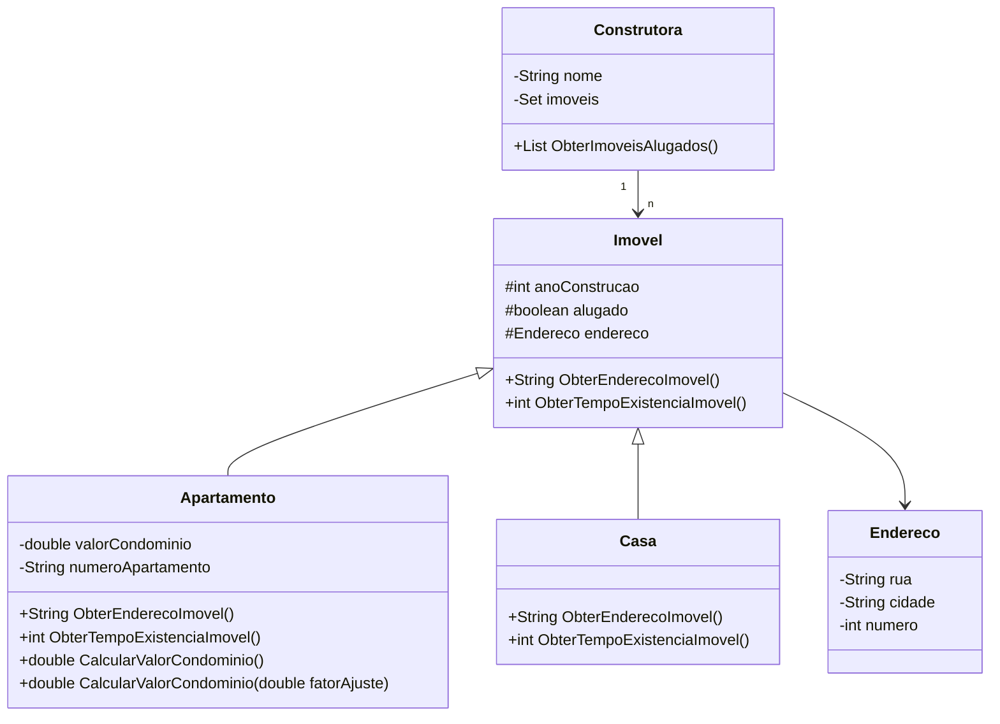

# Claro POO Desafio

## Abstraindo Elementos Usando Orientação a Objetos em Java

Reposítorio contendo o projeto para a prática da programação orientada a objetos: 
- Encapsulamento
- Abstração
- Herança 
- Polimorfismo (Tempo de execução e tempo de compilação)

## Diagrama de Classes

